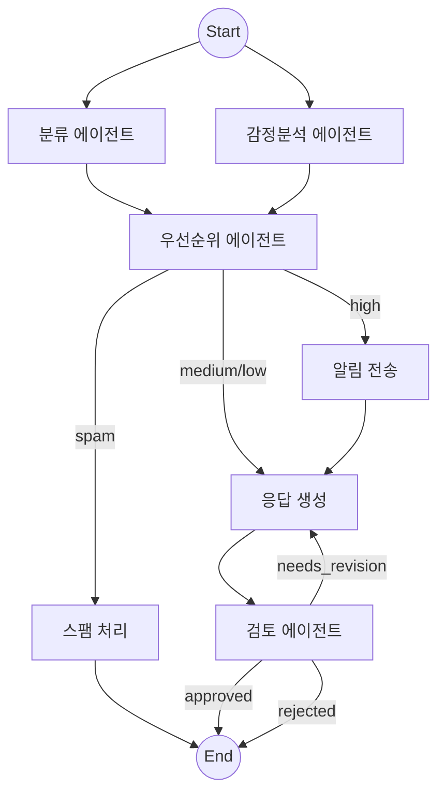

# 📧 AI Email Triage & Auto-Response System

[](https://github.com/dbwjdtn10/ai-email-triage/actions)
[](https://www.python.org/downloads/)
[](https://langchain-ai.github.io/langgraph/)
[](LICENSE)

> **LangGraph 기반 멀티 에이전트 이메일 트리아지 시스템**
>
> 이메일을 AI 에이전트가 자동으로 **분류 → 감정분석 → 우선순위 판단 → 라우팅 → 응답 생성 → 검토 → 승인**까지 처리하는 엔드투엔드 자동화 파이프라인

---

## ✨ 주요 특징

| 특징 | 설명 |
|------|------|
| **멀티 에이전트 아키텍처** | 5개의 전문 에이전트가 독립적으로 동작하며 상태를 공유 |
| **병렬 실행 (Fan-out/Fan-in)** | 분류 + 감정분석을 동시에 실행하여 처리 속도 최적화 |
| **검토-재작성 루프** | Reviewer가 초안을 검증하고 최대 2회 재작성 요청 |
| **Human-in-the-loop** | HIGH 우선순위 건은 사람 승인 후 발송 (LangGraph interrupt) |
| **Fallback 체인** | Primary LLM 실패 시 Backup LLM으로 자동 전환 |
| **Structured Output** | 모든 에이전트가 Pydantic 모델로 타입 안전한 출력 보장 |
| **상태 영속화 (Checkpointer)** | 워크플로우 중간 상태를 SQLite에 저장, 서버 재시작 후 복원 |
| **LangSmith 트레이싱** | 에이전트별 실행 시간, 토큰 사용량, 성공/실패 추적 |
| **평가 파이프라인** | Golden Dataset 기반 Accuracy / Precision / Recall / F1 측정 |

---

## 🏗️ 시스템 아키텍처

```
                        ┌─────────────┐
                        │  이메일 입력  │
                        │ (CLI/API/UI) │
                        └──────┬──────┘
                               │
                 ┌─────────────┴─────────────┐
                 │        Fan-out (병렬)       │
                 ▼                             ▼
        ┌────────────────┐           ┌────────────────┐
        │  분류 에이전트   │           │ 감정분석 에이전트 │
        │  (Classifier)  │           │  (Sentiment)   │
        └───────┬────────┘           └───────┬────────┘
                 │                             │
                 └─────────────┬───────────────┘
                               │  Fan-in
                               ▼
                     ┌──────────────────┐
                     │ 우선순위 에이전트   │
                     │  (Prioritizer)   │
                     └────────┬─────────┘
                              │
                    ┌─────────┼──────────┐
                    │         │          │
                    ▼         ▼          ▼
                 [SPAM]   [HIGH]    [MED/LOW]
                  종료   알림 전송    │
                           │        │
                           ▼        │
                     ┌─────┴────────┘
                     ▼
            ┌────────────────┐
            │ 응답 생성 에이전트 │◄──── 재작성 요청 (최대 2회)
            │(Draft Generator)│          │
            └───────┬────────┘          │
                    │                    │
                    ▼                    │
            ┌────────────────┐          │
            │  검토 에이전트   │──────────┘
            │   (Reviewer)   │
            └───────┬────────┘
                    │
              ┌─────┴─────┐
              ▼           ▼
         [APPROVED]   [HIGH 건]
          자동 발송    Human Approval
                         │
                         ▼
                  [최종 응답 + DB 저장]
```

---

## 🔄 LangGraph 워크플로우



---

## 📊 평가 결과

Golden Dataset 20건 기반 평가 (예시):

| 항목 | 정확도 | 비고 |
|------|--------|------|
| **카테고리 분류** | 90%+ | inquiry / complaint / suggestion / spam / other |
| **우선순위 판단** | 85%+ | high / medium / low |
| **감정 분석** | 85%+ | positive / negative / neutral / urgent |

> 실제 평가 결과는 `triage evaluate` 명령으로 측정할 수 있습니다.

---

## 🛠️ 기술 스택

| 구분 | 기술 | 용도 |
|------|------|------|
| **오케스트레이션** | LangGraph | StateGraph 기반 멀티 에이전트 워크플로우 |
| **LLM 체이닝** | LangChain | 프롬프트 관리, Structured Output, Fallback 체인 |
| **LLM** | GPT-4o-mini + Claude Haiku | Primary + Fallback |
| **모니터링** | LangSmith | 트레이싱, 성능 모니터링 |
| **백엔드** | FastAPI | REST API |
| **프론트엔드** | Streamlit | 대시보드 UI |
| **CLI** | Typer + Rich | 인터랙티브 CLI |
| **데이터베이스** | SQLite | 처리 이력 + Checkpoint 저장 |
| **배포** | Docker Compose | API + Dashboard 원클릭 배포 |
| **CI/CD** | GitHub Actions | 자동 테스트 + 린트 |

---

## 🚀 시작하기

### 사전 요구사항

- Python 3.11+
- OpenAI API Key (필수)
- Anthropic API Key (Fallback용, 선택)
- LangSmith API Key (트레이싱용, 선택)

### 설치

```bash
git clone https://github.com/dbwjdtn10/ai-email-triage.git
cd ai-email-triage

# 의존성 설치
pip install -e ".[dev]"

# 환경 변수 설정
cp .env.example .env
# .env 파일을 열어 API 키를 입력하세요
```

### CLI 사용법

```bash
# 단건 이메일 처리
triage process -s "긴급: 결제 오류" -b "결제가 안됩니다. 확인 부탁드립니다."

# 인터랙티브 모드 (HIGH 건 사람 승인)
triage process -s "서버 장애" -b "서비스가 다운됐습니다" -i

# 배치 처리 (20건)
triage batch -f data/sample_emails.json -o results.json

# 처리 이력 조회
triage history -n 10 --priority high

# 통계 조회
triage stats

# 평가 실행
triage evaluate

# 워크플로우 시각화
triage visualize
```

### API 서버

```bash
uvicorn src.api.main:app --reload

# 요청 예시
curl -X POST http://localhost:8000/api/v1/process \
  -H "Content-Type: application/json" \
  -d '{"sender": "test@email.com", "subject": "문의", "body": "가격이 궁금합니다"}'
```

### 대시보드

```bash
streamlit run dashboard/app.py
# http://localhost:8501
```

### Docker

```bash
docker-compose up
# API: http://localhost:8000
# Dashboard: http://localhost:8501
```

---

## 📁 프로젝트 구조

```
ai-email-triage/
├── src/
│   ├── agents/                  # 5개 전문 에이전트
│   │   ├── classifier.py        # 이메일 카테고리 분류
│   │   ├── prioritizer.py       # 긴급도 판단
│   │   ├── sentiment.py         # 감정 톤 분석
│   │   ├── draft_generator.py   # 응답 초안 생성
│   │   └── reviewer.py          # 품질 검토 + 재작성 루프
│   ├── graph/                   # LangGraph 워크플로우
│   │   ├── state.py             # EmailState (공유 상태)
│   │   ├── nodes.py             # 노드 함수
│   │   ├── edges.py             # 조건부 엣지
│   │   └── workflow.py          # StateGraph 조립
│   ├── prompts/                 # 프롬프트 템플릿 (5개)
│   ├── models/                  # Pydantic 스키마
│   ├── db/                      # SQLite CRUD
│   ├── api/                     # FastAPI REST API
│   └── utils/                   # 설정, 로깅, LLM 팩토리
├── cli/main.py                  # Typer CLI
├── dashboard/app.py             # Streamlit 대시보드
├── eval/                        # 평가 파이프라인
│   ├── golden_dataset.json      # 20건 정답 데이터
│   └── evaluate.py              # Accuracy/F1 측정
├── data/sample_emails.json      # 20건 샘플 이메일
├── tests/                       # 유닛 테스트 (15개)
├── .github/workflows/ci.yml     # GitHub Actions CI
├── Dockerfile                   # Docker 이미지
├── docker-compose.yml           # API + Dashboard 배포
└── pyproject.toml               # 프로젝트 설정
```

---

## 🧪 테스트

```bash
# 전체 테스트 실행
pytest

# 커버리지 포함
pytest --cov=src --cov-report=html

# 특정 테스트
pytest tests/test_classifier.py -v
```

---

## 📈 LangSmith 트레이싱

`.env`에 LangSmith 키를 설정하면 자동으로 모든 에이전트 호출이 트레이싱됩니다:

```env
LANGCHAIN_TRACING_V2=true
LANGCHAIN_API_KEY=lsv2-your-key
LANGCHAIN_PROJECT=ai-email-triage
```

[LangSmith 대시보드](https://smith.langchain.com)에서 확인:
- 에이전트별 실행 시간 / 토큰 사용량
- LLM 호출 체인 시각화
- 에러 트레이스 및 디버깅

---

## 🔮 확장 가능성

- **Gmail API 연동** - 실제 이메일 수신/발송 자동화
- **Slack/Teams 알림** - HIGH 건 발생 시 실시간 알림
- **RAG 도입** - 회사 FAQ 기반 응답 생성 (벡터 DB + 검색 증강)
- **LangGraph Studio** - 시각적 워크플로우 디버깅
- **멀티 테넌트** - 조직별 설정 분리 (SaaS화)
- **LangSmith 평가** - 자동화된 LLM 출력 품질 평가

---

## 📄 License

MIT License
