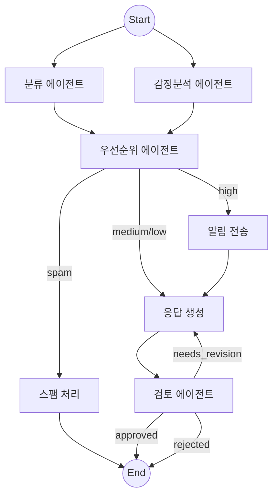
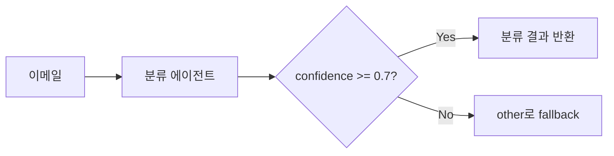
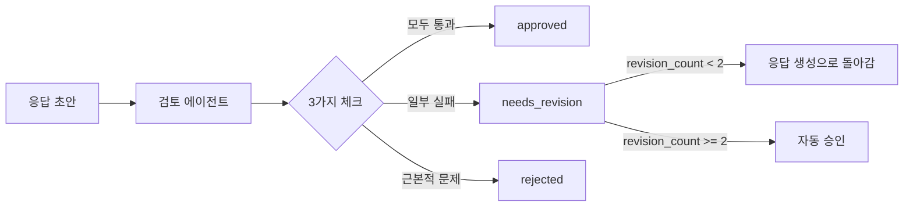
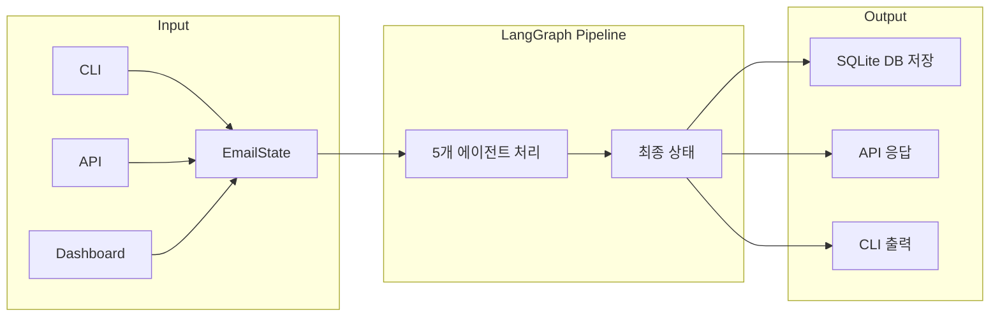
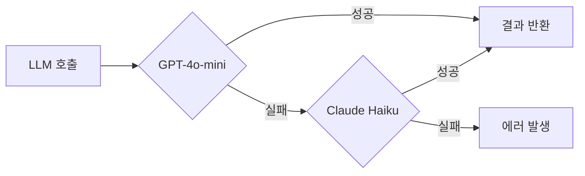

# 아키텍처 문서

## 1. 시스템 개요

AI Email Triage는 LangGraph StateGraph를 활용한 멀티 에이전트 이메일 자동 처리 시스템입니다.
5개의 전문 AI 에이전트가 협업하여 이메일을 분류하고, 감정을 분석하고, 우선순위를 판단하고, 응답을 생성하고, 검토하는 파이프라인을 구성합니다.



---

## 2. 에이전트 구성

### 2.1 분류 에이전트 (ClassifierAgent)



| 항목 | 내용 |
|------|------|
| **입력** | 이메일 제목, 발신자, 본문 |
| **출력** | `ClassificationResult` (category, confidence, reason) |
| **카테고리** | inquiry, complaint, suggestion, spam, other |
| **특이사항** | confidence < 0.7이면 `other`로 fallback |
| **프롬프트** | `src/prompts/classifier.txt` |

### 2.2 감정분석 에이전트 (SentimentAgent)

| 항목 | 내용 |
|------|------|
| **입력** | 이메일 제목, 발신자, 본문 |
| **출력** | `SentimentResult` (sentiment, intensity, summary) |
| **감정** | positive, negative, neutral, urgent |
| **실행 방식** | 분류 에이전트와 **병렬 실행** (Fan-out) |
| **프롬프트** | `src/prompts/sentiment.txt` |

### 2.3 우선순위 에이전트 (PrioritizerAgent)

| 항목 | 내용 |
|------|------|
| **입력** | 이메일 + 분류 결과 + 감정분석 결과 |
| **출력** | `PriorityResult` (priority, reason, keywords) |
| **우선순위** | high, medium, low |
| **실행 방식** | Fan-in (분류 + 감정분석 완료 후 실행) |
| **프롬프트** | `src/prompts/prioritizer.txt` |

### 2.4 응답 생성 에이전트 (DraftGeneratorAgent)

| 항목 | 내용 |
|------|------|
| **입력** | 이메일 + 모든 분석 결과 + 이전 검토 피드백 |
| **출력** | `DraftResult` (response, tone, key_points) |
| **톤** | empathetic (불만), friendly (문의), formal (제안/기타) |
| **특이사항** | 재작성 시 이전 검토 피드백을 프롬프트에 포함 |
| **프롬프트** | `src/prompts/draft_generator.txt` |

### 2.5 검토 에이전트 (ReviewerAgent)



| 항목 | 내용 |
|------|------|
| **입력** | 원본 이메일 + 분석 결과 + 응답 초안 |
| **출력** | `ReviewResult` (decision, feedback, 3가지 체크) |
| **체크 항목** | 톤 적절성, 사실 정확성, 정보 완전성 |
| **특이사항** | 최대 2회 재작성 후 자동 승인 |
| **프롬프트** | `src/prompts/reviewer.txt` |

---

## 3. 워크플로우 패턴

### 3.1 병렬 실행 (Fan-out/Fan-in)

```
START ──┬──→ classify ──────────┬──→ prioritize
        │                       │
        └──→ analyze_sentiment ─┘
```

- 분류와 감정분석은 의존성 없음 → 동시 실행
- `prioritize`는 두 노드 모두 완료될 때까지 자동 대기
- 순차 실행 대비 약 40% 처리 시간 단축

```python
workflow.add_edge(START, "classify")
workflow.add_edge(START, "analyze_sentiment")
workflow.add_edge("classify", "prioritize")
workflow.add_edge("analyze_sentiment", "prioritize")
```

### 3.2 조건부 라우팅

```python
workflow.add_conditional_edges(
    "prioritize",
    route_by_priority,
    {
        "spam": "mark_spam",           # 스팸 → 즉시 종료
        "alert_and_draft": "send_alert", # HIGH → 알림 + 응답 생성
        "draft_only": "generate_draft",  # MEDIUM/LOW → 응답 생성만
    }
)
```

### 3.3 재작성 루프

```
generate_draft → review_draft ──→ (needs_revision) → generate_draft
                              └─→ (approved) → END
                              └─→ (rejected) → END
```

- `revision_count`로 최대 2회까지 제한
- 초과 시 자동 승인 (무한 루프 방지)
- 검토 피드백이 다음 생성의 프롬프트에 포함되어 개선된 초안 생성

### 3.4 Human-in-the-loop

```
[HIGH 이메일] → ... → generate_draft 직전에 INTERRUPT
                                │
                      사람이 승인(Y) / 거절(N) / 수정(edit)
                                │
                         워크플로우 재개
```

- `interrupt_before=["generate_draft"]`로 구현
- `workflow.update_state()`로 사람이 수정한 내용 반영
- Checkpointer가 중간 상태를 저장하여 서버 재시작 후 복원 가능

---

## 4. 데이터 흐름



### EmailState (공유 상태)

모든 노드가 공유하는 상태 객체:

```python
class EmailState(TypedDict):
    # 입력
    email_id, sender, subject, body, received_at

    # 분류
    category, category_confidence, category_reason

    # 감정 분석
    sentiment, sentiment_intensity, sentiment_summary

    # 우선순위
    priority, priority_reason, priority_keywords

    # 응답 생성
    draft_response, draft_tone, draft_key_points

    # 검토
    review_decision, review_feedback, revision_count

    # 최종
    final_response, human_approved

    # 로그 (Annotated[list, add]로 자동 누적)
    processing_log
```

---

## 5. Fallback 체인



```python
llm = primary.with_fallbacks([fallback])
```

---

## 6. 상태 영속화 (Checkpointer)

| 모드 | Checkpointer | 용도 | 데이터 위치 |
|------|-------------|------|------------|
| 인메모리 | `MemorySaver` | 개발/테스트 | 메모리 (프로세스 종료 시 삭제) |
| 영속 | `SqliteSaver` | 프로덕션 | `data/triage.checkpoint.db` |

---

## 7. 인프라 구성

```
┌─────────────────────────────────────┐
│           Docker Compose            │
│                                     │
│  ┌───────────┐   ┌──────────────┐  │
│  │  FastAPI   │   │  Streamlit   │  │
│  │  :8000     │   │  :8501       │  │
│  └─────┬─────┘   └──────┬───────┘  │
│        │                 │          │
│        └────────┬────────┘          │
│                 │                   │
│        ┌────────┴────────┐          │
│        │    SQLite DB    │          │
│        │  data/triage.db │          │
│        └─────────────────┘          │
└─────────────────────────────────────┘
```
